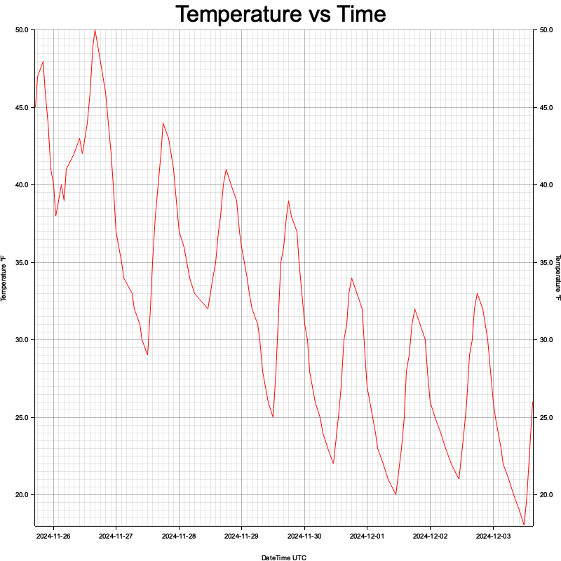

# foreplot
Command line tool to generate plots based on [National Weather Service](https://www.weather.gov/documentation/services-web-api) forecast data.

## Usage
`foreplot <LATITUDE> <LONGITUDE> [IMAGE_PATH]`

The default IMAGE_PATH will be `./temperature_chart_LATITUDE_LONGITUDE_DATETIME.png`

## Features
- temperature plot
  

